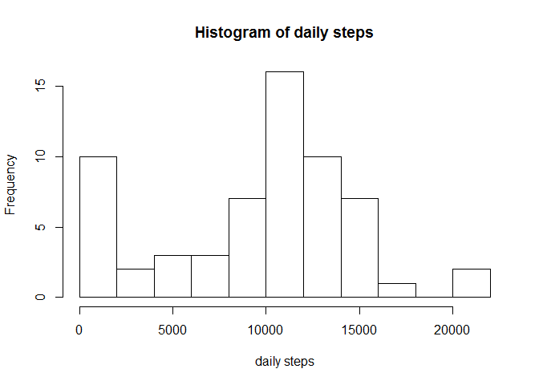
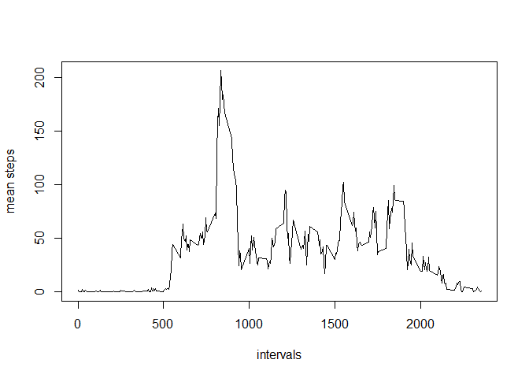
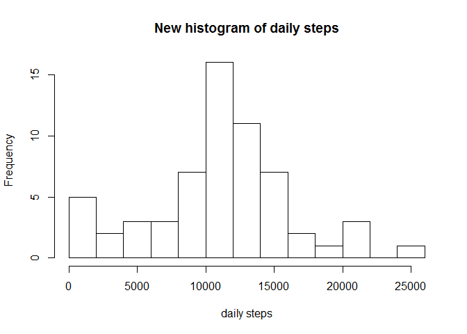
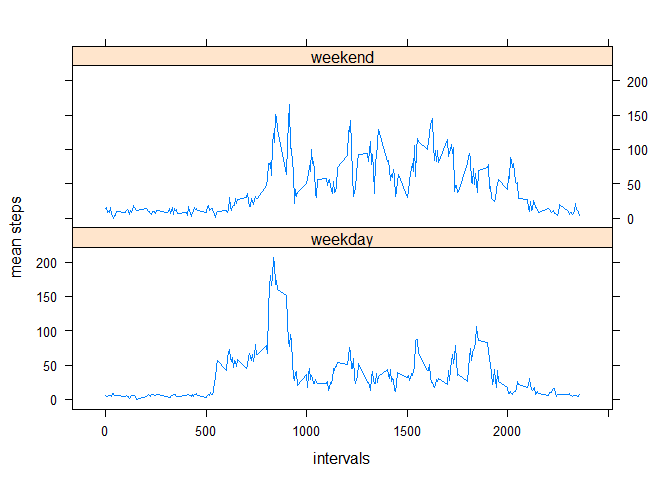

# Reproducible Research: Peer Assessment 1


## Loading and preprocessing the data

### 1.Load the data

```r
unzip("activity.zip",exdir = ".")
activity = read.csv("activity.csv")
```

### 2. Process/transform the data (if necessary) into a format suitable for your analysis


```r
library(data.table)
datatable= data.table(activity)
```

## What is mean total number of steps taken per day?

### 1.Calculate the total number of steps taken per day

```r
daily_steps = datatable[,sum(steps, na.rm = TRUE), by = date]
names(daily_steps)[2] <- "steps"
```

### 2. Make a histogram of the total number of steps taken each day

```r
hist(daily_steps$steps, breaks = 10, main = "Histogram of daily steps", xlab = "daily steps")
```

 

### 3. Calculate and report the mean and median of the total number of steps taken per day


```r
mean_steps = mean(daily_steps$steps)
median_steps = median(daily_steps$steps)
```

mean of the total number of steps taken per day is:

```r
mean_steps
```

```
## [1] 9354.23
```

median of the total number of steps taken per day is:

```r
median_steps
```

```
## [1] 10395
```

## What is the average daily activity pattern?

### 1. Make a time series plot (i.e. type = "l") of the 5-minute interval (x-axis) and the average number of steps taken, averaged across all days (y-axis)


```r
interval_steps = datatable[,mean(steps, na.rm = TRUE), by = interval]
names(interval_steps)[2] <- "MeanSteps"
plot(interval_steps$interval, interval_steps$MeanSteps, type = "l", xlab = "intervals", ylab = "mean steps")
```

 

### 2. Which 5-minute interval, on average across all the days in the dataset, contains the maximum number of steps?

The maximum mean steps interval is:


```r
interval_steps$interval[interval_steps$MeanSteps == max(interval_steps$MeanSteps)]
```

```
## [1] 835
```

## Imputing missing values

### 1. Calculate and report the total number of missing values in the dataset (i.e. the total number of rows with NAs)


```r
total_missing = nrow(datatable[is.na(steps), ])
```

Total number of missing values in the dataset is:

```r
total_missing
```

```
## [1] 2304
```

### 2. Devise a strategy for filling in all of the missing values in the dataset. The strategy does not need to be sophisticated. For example, you could use the mean/median for that day, or the mean for that 5-minute interval, etc.

Use the mean for current 5-minute interval *times* a weight for current day (daily mean steps *over* all days mean steps) to fill in the missing value intervals:


```r
alldays_mean = mean(daily_steps$steps)
daily_weight = cbind(daily_steps, daily_steps$steps/alldays_mean)
names(daily_weight)[3] = "weight"

data_fill <- datatable
names(data_fill)[1] = "tofill"
data_fill = merge(data_fill, daily_weight, by = "date")
data_fill = merge(data_fill, interval_steps, by = "interval")
data_fill = cbind(data_fill, data_fill$weight*data_fill$MeanSteps)
names(data_fill)[7] = "fill_steps"
```

### 3. Create a new dataset that is equal to the original dataset but with the missing data filled in.


```r
new_data = datatable
index    = which(is.na(new_data$tofill));
for(i in index) new_data$tofill[i] = data_fill$fill_steps[i]
names(new_data)[1] <- "steps"
```

### 4. Make a histogram of the total number of steps taken each day and Calculate and report the mean and median total number of steps taken per day. Do these values differ from the estimates from the first part of the assignment? What is the impact of imputing missing data on the estimates of the total daily number of steps?


```r
new_daily_steps = new_data[,sum(steps, na.rm = TRUE), by = date]
names(new_daily_steps)[2] <- "steps"
hist(new_daily_steps$steps, breaks = 10, main = "New histogram of daily steps", xlab = "daily steps")
```

 


```r
new_mean_steps = mean(new_daily_steps$steps)
new_median_steps = median(new_daily_steps$steps)
```

mean of the total number of steps taken per day is:

```r
new_mean_steps
```

```
## [1] 10890.92
```

median of the total number of steps taken per day is:

```r
new_median_steps
```

```
## [1] 11015
```

The results are different. The daily number of steps increases in general. The mean and median number of daily steps both increase. From the histogram we can see that number of days with more steps increases, while number of days with less steps decreases.

## Are there differences in activity patterns between weekdays and weekends?

### 1. Create a new factor variable in the dataset with two levels - "weekday" and "weekend" indicating whether a given date is a weekday or weekend day.


```r
weekday    = weekdays(as.Date(new_data$date), abbreviate = FALSE)
new_factor = weekday
new_factor[which(weekday == "Saturday"|weekday =="Sunday")] = "weekend"
new_factor[which(weekday != "Saturday" & weekday !="Sunday")] = "weekday"

new_data = cbind(new_data, new_factor)

names(new_data)[4] = "weekdays"
```

### 2. Make a panel plot containing a time series plot (i.e. type = "l") of the 5-minute interval (x-axis) and the average number of steps taken, averaged across all weekday days or weekend days (y-axis). 


```r
data_weekday = subset(new_data, weekdays == "weekday")
data_weekend = subset(new_data, weekdays == "weekend")
interval_steps_weekday = data_weekday[,mean(steps, na.rm = TRUE), by = interval]
interval_steps_weekend = data_weekend[,mean(steps, na.rm = TRUE), by = interval]
interval_steps_weekday$weekday_or_weekend = "weekday"
interval_steps_weekend$weekday_or_weekend = "weekend"
data_all = rbind(interval_steps_weekday, interval_steps_weekend)
names(data_all)[2] <- "interval_mean"

library(lattice)
xyplot(interval_mean ~ interval| weekday_or_weekend, data = data_all, type = "l", horizontal = "h", xlab = "intervals", ylab = "mean steps",layout = c(1,2))
```

 

